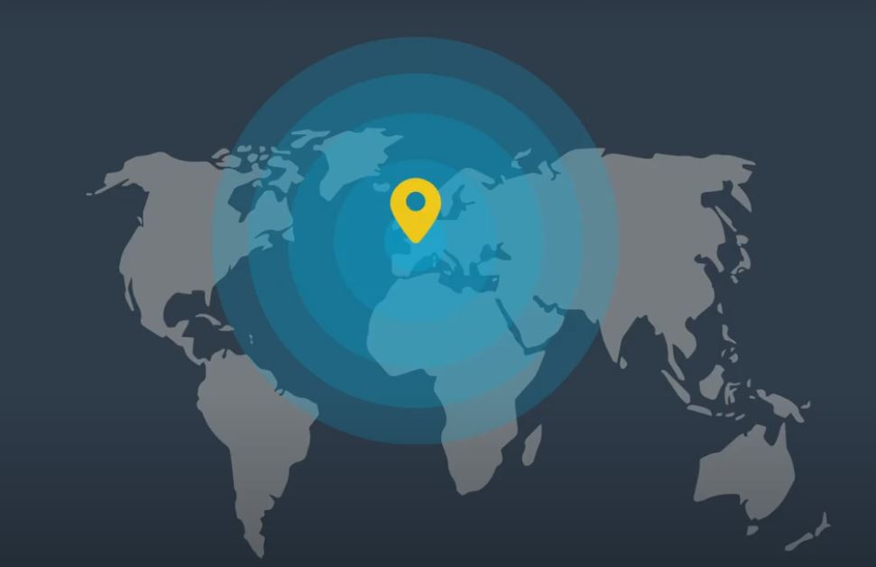

# CarND-Kidnapped-Vehicle-Project





## Project Introduction

Suppose a vehicle has been kidnapped and transported to a new location! Fortunately, you have a map of this location, a GPS (noisy) estimate of your starting location, and lots of (noisy) sensor and control data.

In that project our vehicle has been kidnapped and placed in an unknown location. We must leverage our knowledge of localization to determine where our vehicle is. The Kidnapped Vehicle Project relies heavily on the particle filter approach to localization, particularly implementation. It will be developed using C ++ in a two-dimensional implementation. The particle filter has a map and some initial location information (analogous to GPS). At each time step, the filter also reports observation and control data.

## Localization

In a self-Driving Car One of the problems that we are trying to solve is the location.
Let's think for a moment that there could be a car or a mobile robot in an environment, the vehicle or the robot does not know where it is, similarly there could be a vehicle moving on a road, and we would like to know where it is if it is within the tracks or on the guidelines of the same.
The traditional way to solve this problem is by using satellites.
These emit signals that the car can persist. It is known as GPS (Global Positioning System) in the map template, and you can see where you are.
Unfortunately, the problem with GPS is that it is not very accurate.
It is common for a driver to believe in the position indicated by the GPS but has a 2 m to 10 m error in the location.
In such a way that if you try to stay on the road with 10 meters of error, it would be quite far, and if you drive based on that location, you will surely have problems.
For our self-directed vehicle to stay on the road using localization, we will need something like 2 to 10 centimeters of error.


## Files

The following files are part of this project: 
* particle_filter.cpp:   Particle Filter class definition;
* map.cpp: Map class definition;
* main.cpp: Main file; 
* images: 
** success.png:  Location Estimation using the Udacity Simulator; 

### Dependency

This project requires the following packages to work:
* Udacity Simulator [https://github.com/udacity/self-driving-car-sim/releases/](https://github.com/udacity/self-driving-car-sim/releases/);
* cmake 3.5 or above;
* make 4.1 or above;
* gcc/g++: 5.4 or above;
* uWebSocketIO;

### WebSocketIO

This project uses the open source package called WebScokectIO to facilitate the communication between the 
Particle Filter and the Udacity Simulator. To install all the websocketio libs, execute the script ``install-ubuntu.sh`` from the project repository directory.

## How to use this project

To run this project, you first need to compile the code. After the code is compiled, please, run the Udacity simulator and the ``particle_filter`` binary created at the build folder.

### Compiling and Running

The main program can be built and run by doing the following from the project top directory.

1. ./build.sh
2. cd build
3. ./particle_filter
4. Run the Udacity Simulator

# Implementing the Particle Filter
The directory structure of this repository is as follows:

```
root
|   build.sh
|   clean.sh
|   CMakeLists.txt
|   README.md
|   run.sh
|
|___data
|   |   
|   |   map_data.txt
|   
|   
|___src
    |   helper_functions.h
    |   main.cpp
    |   map.h
    |   particle_filter.cpp
    |   particle_filter.h
```

The only file you should modify is `particle_filter.cpp` in the `src` directory. The file contains the scaffolding of a `ParticleFilter` class and some associated methods. Read through the code, the comments, and the header file `particle_filter.h` to get a sense for what this code is expected to do.

If you are interested, take a look at `src/main.cpp` as well. This file contains the code that will actually be running your particle filter and calling the associated methods.

## Inputs to the Particle Filter
You can find the inputs to the particle filter in the `data` directory.

#### The Map*
`map_data.txt` includes the position of landmarks (in meters) on an arbitrary Cartesian coordinate system. Each row has three columns
1. x position
2. y position
3. landmark id

## Results


# CarND-Kidnapped-Vehicle-Project


## Project Introduction

Suppose a vehicle has been kidnapped and transported to a new location! Fortunately, you have a map of this location, a GPS (noisy) estimate of your starting location, and lots of (noisy) sensor and control data.

In that project our vehicle has been kidnapped and placed in an unknown location. We must leverage our knowledge of localization to determine where our vehicle is. The Kidnapped Vehicle Project relies heavily on the particle filter approach to localization, particularly implementation. It will be developed using C ++ in a two-dimensional implementation. The particle filter has a map and some initial location information (analogous to GPS). At each time step, the filter also reports observation and control data.

## Localization

In a self-Driving Car One of the problems that we are trying to solve is the location.
Let's think for a moment that there could be a car or a mobile robot in an environment, the vehicle or the robot does not know where it is, similarly there could be a vehicle moving on a road, and we would like to know where it is if it is within the tracks or on the guidelines of the same.
The traditional way to solve this problem is by using satellites.
These emit signals that the car can persist. It is known as GPS (Global Positioning System) in the map template, and you can see where you are.
Unfortunately, the problem with GPS is that it is not very accurate.
It is common for a driver to believe in the position indicated by the GPS but has a 2 m to 10 m error in the location.
In such a way that if you try to stay on the road with 10 meters of error, it would be quite far, and if you drive based on that location, you will surely have problems.
For our self-directed vehicle to stay on the road using localization, we will need something like 2 to 10 centimeters of error.


## Files

The following files are part of this project: 
* particle_filter.cpp:   Particle Filter class definition;
* map.cpp: Map class definition;
* main.cpp: Main file; 
* images: 
** success.png:  Location Estimation using the Udacity Simulator; 

### Dependency

This project requires the following packages to work:
* Udacity Simulator [https://github.com/udacity/self-driving-car-sim/releases/](https://github.com/udacity/self-driving-car-sim/releases/);
* cmake 3.5 or above;
* make 4.1 or above;
* gcc/g++: 5.4 or above;
* uWebSocketIO;

### WebSocketIO

This project uses the open source package called WebScokectIO to facilitate the communication between the 
Particle Filter and the Udacity Simulator. To install all the websocketio libs, execute the script ``install-ubuntu.sh`` from the project repository directory.

## How to use this project

To run this project, you first need to compile the code. After the code is compiled, please, run the Udacity simulator and the ``particle_filter`` binary created at the build folder.

### Compiling and Running

The main program can be built and run by doing the following from the project top directory.

1. ./build.sh
2. cd build
3. ./particle_filter
4. Run the Udacity Simulator

# Implementing the Particle Filter
The directory structure of this repository is as follows:

```
root
|   build.sh
|   clean.sh
|   CMakeLists.txt
|   README.md
|   run.sh
|
|___data
|   |   
|   |   map_data.txt
|   
|   
|___src
    |   helper_functions.h
    |   main.cpp
    |   map.h
    |   particle_filter.cpp
    |   particle_filter.h
```

The only file you should modify is `particle_filter.cpp` in the `src` directory. The file contains the scaffolding of a `ParticleFilter` class and some associated methods. Read through the code, the comments, and the header file `particle_filter.h` to get a sense for what this code is expected to do.

If you are interested, take a look at `src/main.cpp` as well. This file contains the code that will actually be running your particle filter and calling the associated methods.

## Inputs to the Particle Filter
You can find the inputs to the particle filter in the `data` directory.

#### The Map*
`map_data.txt` includes the position of landmarks (in meters) on an arbitrary Cartesian coordinate system. Each row has three columns
1. x position
2. y position
3. landmark id

## Results


https://user-images.githubusercontent.com/17582812/128587531-bde6b1d6-8e6b-41e5-8c3d-a8a2b89510bb.mp4

